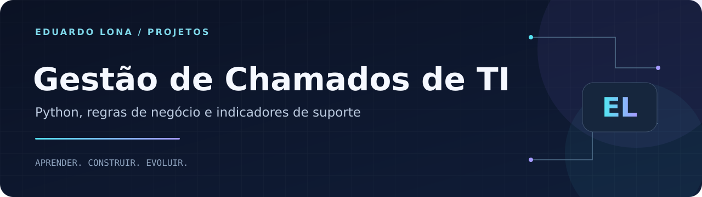
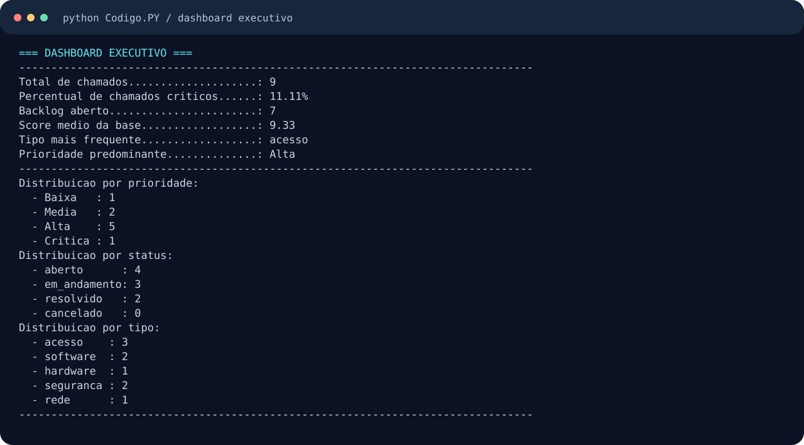

<p align="center"></p>

<p align="center"><strong>Python · JSON · CLI · PIM acadêmico</strong></p>
<p align="center"><a href="#sobre">Sobre</a> · <a href="#como-executar">Como executar</a> · <a href="https://github.com/Dudulonabr">Perfil do autor</a></p>

# Sistema de Gestão de Chamados de TI

## Sobre

Aplicação acadêmica em **Python** que simula o atendimento interno de TI: registra incidentes, calcula a prioridade, associa um prazo de SLA e apresenta indicadores para acompanhar a operação. O projeto conecta fundamentos de programação a um cenário de **help desk e suporte técnico**.

O contexto Microsoft faz parte do trabalho PIM. Este é um projeto acadêmico independente, sem vínculo oficial com a empresa.

## Funcionalidades

- Cadastro com ID incremental, data de criação e parecer automático.
- Priorização por impacto, urgência e tipo de incidente.
- Atualização dos estados `aberto`, `em_andamento`, `resolvido` e `cancelado`.
- Listagem por criticidade, busca interna por ID e filtros por prioridade ou tipo.
- Persistência em JSON para manter os chamados entre execuções.
- Dashboard com total, percentual crítico, backlog e score médio.
- Geração de chamados fictícios e relatório textual.

## Prévia do programa



A imagem apresenta a saída do próprio programa, executado com sua base de demonstração.

## Como executar

Utilize **Python 3.10 ou superior**. O projeto usa apenas a biblioteca padrão, sem dependências externas.

```bash
git clone https://github.com/Dudulonabr/PIM-Microsoft.git
cd PIM-Microsoft
python Codigo.PY
```

Em ambientes que utilizam o comando `python3`, execute `python3 Codigo.PY`. Mantenha o terminal na pasta do projeto: os dados são lidos e salvos em `chamados_microsoft.json`. Ao cadastrar, atualizar ou simular chamados, essa base local é alterada.

## Regras de negócio

O score soma os pontos de **impacto + urgência + tipo**. Impacto e urgência recebem 1, 3 ou 5 pontos. O tipo recebe 1 para acesso, 2 para software/hardware, 3 para rede e 4 para segurança.

| Score | Prioridade | SLA associado |
| --- | --- | --- |
| Até 4 | Baixa | 72 horas |
| 5 a 8 | Média | 24 horas |
| 9 a 12 | Alta | 8 horas |
| A partir de 13 | Crítica | 1 hora |

**Exemplo:** impacto alto (5) + urgência alta (5) + incidente de segurança (4) = **14 pontos**, prioridade **Crítica** e SLA de **1 hora**.

O SLA é um prazo associado à prioridade. A versão atual não mede automaticamente o tempo restante nem envia alertas de vencimento.

## Organização e aprendizados

| Elemento | Responsabilidade |
| --- | --- |
| `Chamado` | Modelo de dados com `dataclass` |
| Funções de prioridade | Score, classificação e parecer |
| Funções de persistência | Leitura e escrita de JSON |
| Funções de serviço | Cadastro, consulta e atualização |
| Menu no terminal | Interação com o usuário |
| Dashboard e relatório | Agregação e apresentação de dados |

As responsabilidades estão organizadas por seções dentro de **`Codigo.PY`**, em um único arquivo. O projeto demonstra condicionais, repetição, funções, tratamento de entradas, serialização e regras de negócio.

## Possíveis evoluções

- Separar as responsabilidades em módulos.
- Adicionar testes das regras de prioridade e persistência.
- Medir vencimentos de SLA e armazenar o histórico de alterações.
- Criar uma interface web e persistência em banco de dados.

Essas melhorias são propostas para versões futuras.

## Autor

**Eduardo Moreira Monteiro Lona** · São Paulo, Brasil

Estudante de **Análise e Desenvolvimento de Sistemas (UNIP)** e **Engenharia de Software (Cruzeiro do Sul)**, com formação técnica em **Informática pelo SENAC**.

[LinkedIn](https://www.linkedin.com/in/eduardo-moreira-monteiro-lona) · [E-mail](mailto:dudulona07@gmail.com) · [GitHub](https://github.com/Dudulonabr)
